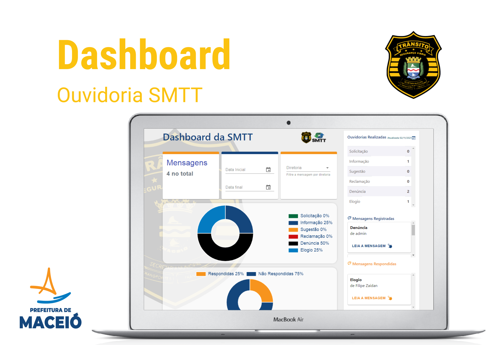

# ***Dashboard Ouvidoria SMTT*** :pager:

<h1 align=center>
  
</h1>

![NodeBadge][node_badge] ![Yarn][yarn] ![Figma][figma] ![VSCode][vscode] ![Git][git] ![HTML][html] ![CSS][css] ![JavaScript][javascript_badge] ![React][react] ![Material-UI][materialui] ![Netlify][netlify] ![Heroku][heroku]

 

<h3 align=center>
  
:books:
***Dashboard Ouvidoria SMTT*** is a project to filter the data of the ombudsman's registered in SMTT.
</h3>

<h2 align=center>
  <i>Screen Web </i> :pager:
</h2>

  

## ***:rocket: OBJECTIVE***

 
The main objective of the project is to display the data of the registered ombudsman's office in the SMTT system, making it possible to graphically visualize the information saved and filter this data based on dates and/or responsible board. JavaScript was used as a programming language along with React JS, HTML and CSS for the overall development of the platform.

## ***:computer: TECHNOLOGIES***

#### ***:pager: Website ([React][react])***

  - **[NodeJS][node]**
  - **[Yarn][yarn]**
  - **[Figma][figma]**
  - **[VSCode][vscode]**
  - **[Git][git]**
  - **[HTML][html]**
  - **[CSS][css]**
  - **[JavaScript][javascript]**
  - **[React][react]**
  - **[React Router Dom][react_router_dom]**
  - **[React Icons][react_icons]**
  - **[Material-UI][material_ui]**
  - **[Netlify][netlify]**
  - **[Heroku][heroku]**

## ***:star2: Collaborators***

<table style="width:100%">
  <tr align=center>
    <th><strong>Luiz Carlos Vilela</strong></th>
    <th><strong>Filipe Zaidan</strong></th>
  </tr>
  <tr align=center>
    <td>
      
    </td>
    <td>
      
    </td>
  </tr>
</table>

<i><h2 align="center">Made with ❤️ by <a href="https://www.linkedin.com/in/luiz-carlos-vilela/">Luiz Carlos Vilela</a></h2></i>

<!-- Badges -->

[node_badge]: https://img.shields.io/badge/-Node.js-05122A?style=flat&logo=node.js
[yarn]: https://img.shields.io/badge/-Yarn-05122A?style=flat&logo=yarn

[figma]: https://img.shields.io/badge/-Figma-05122A?style=flat&logo=figma

[vscode]: https://img.shields.io/badge/-Visual%20Studio%20Code-05122A?style=flat&logo=visual-studio-code&logoColor=007ACC
[git]: https://img.shields.io/badge/-Git-05122A?style=flat&logo=git

[html]: https://img.shields.io/badge/-HTML-05122A?style=flat&logo=HTML5
[css]: https://img.shields.io/badge/-CSS-05122A?style=flat&logo=CSS3&logoColor=1572B6
[javascript_badge]: https://img.shields.io/badge/-JavaScript-05122A?style=flat&logo=javascript

[react]: https://img.shields.io/badge/-React-05122A?style=flat&logo=react
[materialui]: https://img.shields.io/badge/-React-05122A?style=flat&logo=materialui

[netlify]: https://img.shields.io/badge/-Netlify-05122A?style=flat&logo=netlify
[heroku]: https://img.shields.io/badge/-Heroku-05122A?style=flat&logo=heroku

<!-- Techs -->

[node]: https://nodejs.org/en/
[yarn]: https://classic.yarnpkg.com/lang/en/docs/getting-started/

[figma]: https://www.figma.com/plugin-docs/intro/

[vscode]: https://code.visualstudio.com/
[git]: https://git-scm.com/doc

[html]: https://devdocs.io/html/
[css]: https://devdocs.io/css/

[javascript]: https://devdocs.io/javascript/
[react]: https://reactjs.org/
[react_router_dom]: https://github.com/ReactTraining/react-router/tree/master/packages/react-router-dom
[react_icons]: https://react-icons.github.io/react-icons/
[material_ui]: https://material-ui.com/

[netlify]: https://docs.netlify.com/
[heroku]: https://devcenter.heroku.com/categories/reference
